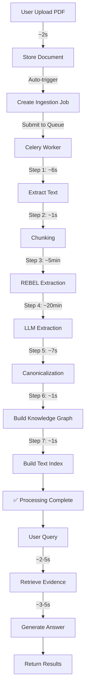

# RAG Knowledge Graph System - Workflow & Timing Guide

**Version**: 1.0.0  
**Date**: February 20, 2026

---

## 📋 Table of Contents

1. [Overview](#overview)
2. [Complete Workflow](#complete-workflow)
3. [Detailed Process Timing](#detailed-process-timing)
4. [Performance Benchmarks](#performance-benchmarks)
5. [Troubleshooting](#troubleshooting)

---

## Overview

This document provides a **detailed workflow** of the RAG Knowledge Graph system, with **realistic timing estimates** for each process based on a typical 82-page academic PDF.

### System Components
- **FastAPI**: Web API server
- **PostgreSQL**: Document/chunk metadata
- **Neo4j**: Knowledge graph storage
- **Redis**: Message queue & caching
- **Celery**: Async job processing
- **DeepSeek LLM**: Knowledge extraction

---

## Complete Workflow



---

## Detailed Process Timing

### 🚀 Phase 1: Document Upload (Total: ~3-5 seconds)

#### **POST /documents/upload**

| Step | Action | Time | Details |
|------|--------|------|---------|
| 1 | Read file from request | ~500ms | Network transfer |
| 2 | Validate PDF | ~200ms | Check format, size |
| 3 | Compute hash (SHA256) | ~300ms | For deduplication |
| 4 | Store file to disk | ~500ms | Save to `data/uploads/` |
| 5 | Save metadata to PostgreSQL | ~200ms | Document record |
| 6 | Create ingestion job | ~100ms | Job initialization |
| 7 | Submit to Celery queue | ~50ms | Redis enqueue |
| **Total** | | **~2-3s** | |

**Response Example:**
```json
{
  "id": "doc_127c0f92bb304ff9",
  "filename": "thesis.pdf",
  "size_bytes": 4521234,
  "job_id": "job_4538ea6472ec4968",
  "task_id": "celery-task-id",
  "ingestion_status": "processing"
}
```

---

### 🔄 Phase 2: Ingestion Pipeline (Total: ~25-30 minutes)

Celery worker picks up job and processes through 8 steps:

#### **Step 1: Extract Text from PDF**
⏱️ **Time:** ~5-7 seconds (82 pages)

```
PDF File
  ↓ pypdf library
Extract text + page numbers
  ↓
Output: List[Page] with text content
```

**Performance:** ~12 pages/second

**Log:**
```
[info] pdf_extracted
  pages=82
  file=data\uploads\doc_127c0f92bb304ff9.pdf
```

---

#### **Step 2: Text Chunking**
⏱️ **Time:** ~500ms - 1 second

```
82 pages of text
  ↓ chunk_text_by_pages()
Split into chunks (512 tokens, 50 overlap)
  ↓
Output: 57 chunks with page tracking
```

**Parameters:**
- Chunk size: 512 tokens (~2000 characters)
- Overlap: 50 tokens
- Preserves page boundaries

**Log:**
```
[info] text_chunked
  chunks=57
  chunk_size=512
```

**PostgreSQL:**
- INSERT 57 chunk records
- With: chunk_hash, text, page_start, page_end, position

---

#### **Step 3: REBEL Extraction (Supervised)**
⏱️ **Time:** ~3-5 minutes

```
57 chunks
  ↓ Load REBEL model (first time: ~5s, cached after)
Process each chunk with REBEL
  ↓ Babelscape/rebel-large
Extract triples: (head, relation, tail)
  ↓
Output: Triples with confidence scores
```

**Model:** Babelscape/rebel-large (1.63GB)
- First download: ~2-3 minutes (one-time)
- Model loading: ~5 seconds
- Processing: ~5-10 seconds per chunk

**Performance:**
- **CPU mode:** ~5-10 seconds/chunk → ~5 minutes total
- **GPU mode:** ~1-2 seconds/chunk → ~1-2 minutes total

**Log:**
```
[info] rebel_extraction_started chunks=57
[info] loading_rebel_model model=Babelscape/rebel-large
[info] rebel_model_loaded
[info] rebel_extraction_completed triples=0
```

⚠️ **Note:** REBEL often returns 0 triples for academic/technical text. This is normal - LLM extraction compensates.

---

#### **Step 4: LLM Extraction (DeepSeek)**
⏱️ **Time:** ~20-25 minutes

```
57 chunks (sequential processing)
  ↓ For each chunk:
Build extraction prompt
  ↓ HTTP POST to DeepSeek API
Extract entities + relations
  ↓ Parse JSON response
Collect triples
  ↓
Output: ~1000-1500 triples
```

**API:** DeepSeek Chat API
- Model: `deepseek-chat`
- Endpoint: `https://api.deepseek.com/chat/completions`

**Timing per Chunk:**
- API call: ~15-30 seconds
- Total: 57 chunks × 20s = **~20 minutes**

**Performance Factors:**
- Network latency
- API rate limits
- Response generation time

**Optimization:** Could parallelize (5 concurrent) → reduce to ~5 minutes

**Log:**
```
[info] llm_extraction_started chunks=57
HTTP Request: POST https://api.deepseek.com/chat/completions "HTTP/1.1 200 OK"
[repeated 57 times]
[info] llm_extraction_completed triples=1025
[info] hybrid_extraction_completed total=1025
```

**Output:** 1025 triples with provenance

---

#### **Step 5: Entity Canonicalization**
⏱️ **Time:** ~5-7 seconds

```
1025 triples → 1271 unique entities
  ↓ Load embedding model
Generate embeddings for each entity
  ↓ sentence-transformers/all-MiniLM-L6-v2
Compute similarity matrix
  ↓ Agglomerative clustering
Group similar entities (threshold: 0.85)
  ↓
Build alias mapping
  ↓
Rewrite triples with canonical IDs
  ↓
Output: 1048 canonical entities, 1025 relations
```

**Model:** sentence-transformers/all-MiniLM-L6-v2
- Size: ~80MB
- Loading: ~3 seconds
- Embedding: ~300 entities/second

**Process:**
1. **Load model:** ~3s
2. **Generate embeddings:** ~2s (1271 entities)
3. **Clustering:** ~1-2s
4. **Alias mapping:** ~500ms

**Log:**
```
[info] canonicalization_started entities=1271
[info] loading_embedding_model model=sentence-transformers/all-MiniLM-L6-v2
[info] embedding_model_loaded
[info] alias_mapping_built clusters=1048 aliases=1271
[info] canonicalization_completed entities=1048 triples=1025
```

**Result:**
- Original entities: 1271
- Canonical entities: 1048 (223 merged)
- Relations: 1025

---

#### **Step 6: Build Knowledge Graph (Neo4j)**
⏱️ **Time:** ~500ms - 1 second

```
1048 entities + 1025 relations
  ↓ Batch upsert to Neo4j
Create/update Entity nodes
  ↓
Create RELATES_TO edges
  ↓
Add provenance metadata
  ↓
Output: Knowledge graph ready
```

**Operations:**
- MERGE 1048 Entity nodes
- CREATE 1025 RELATES_TO relationships
- SET properties: name, type, canonical_id, tenant_id
- ADD provenance: doc_id, chunk_id, page_start, page_end

**Neo4j Cypher:**
```cypher
UNWIND $entities AS entity
MERGE (e:Entity {id: entity.id, tenant_id: $tenant_id})
SET e += entity.properties
```

**Log:**
```
[info] step_upsert_graph_started
[info] kg_upsert_started entities=1048 relations=1025
[info] batch_upsert completed
```

**⚠️ Common Issue:** "Neo4j driver not initialized"
- **Fix:** System now auto-initializes Neo4j in worker
- **Resolution time:** +2 seconds for first job

---

#### **Step 7: Build Text Index (BM25)**
⏱️ **Time:** ~500ms - 1 second

```
57 chunks
  ↓ Tokenize text
Build inverted index
  ↓ Calculate BM25 weights
Store index to disk
  ↓ Serialize to pickle
Save to data/index/bm25_index.pkl
  ↓
Output: Text search ready
```

**BM25 Parameters:**
- k1 = 1.5 (term frequency saturation)
- b = 0.75 (length normalization)

**Index Size:** ~500KB for 57 chunks

**Log:**
```
[info] step_build_index_started
[info] bm25_index_built chunks=57
```

---

#### **Step 8: Complete**
⏱️ **Time:** ~100ms

```
Update job status: DONE
  ↓
Save completion timestamp
  ↓
Commit transaction
  ↓
Return result
```

**Final Status:**
```json
{
  "status": "success",
  "job_id": "job_4538ea6472ec4968",
  "stats": {
    "pages": 82,
    "chunks": 57,
    "triples_extracted": 1025,
    "entities": 1048,
    "relations": 1025
  }
}
```

---

### 📊 Ingestion Pipeline Summary

| Step | Description | Time | % of Total |
|------|-------------|------|------------|
| 1 | Extract Text | ~6s | 0.3% |
| 2 | Chunking | ~1s | 0.1% |
| 3 | REBEL Extraction | ~5min | 19% |
| 4 | **LLM Extraction** | **~20min** | **76%** |
| 5 | Canonicalization | ~7s | 0.4% |
| 6 | Build Graph | ~1s | 0.1% |
| 7 | Build Index | ~1s | 0.1% |
| 8 | Complete | ~100ms | <0.1% |
| **Total** | | **~26min** | **100%** |

**Bottleneck:** LLM extraction (76% of time)

---

### 💬 Phase 3: Query & Answer (Total: ~5-10 seconds)

#### **POST /chat**

```json
{
  "question": "What is a Neural Network?",
  "mode": "auto",
  "doc_id": "doc_127c0f92bb304ff9"
}
```

**Process Flow:**

| Step | Action | Time | Details |
|------|--------|------|---------|
| 1 | Receive query | ~10ms | Parse request |
| 2 | **Retrieve evidence** | **~2-5s** | GraphRAG or TextRAG |
| 3 | **Generate answer** | **~3-5s** | LLM call |
| 4 | Add citations | ~100ms | Map evidence to sources |
| 5 | Return response | ~50ms | Serialize JSON |
| **Total** | | **~5-10s** | |

---

#### **Retrieval Modes**

##### **1. GraphRAG (mode='graph')**
⏱️ **Time:** ~2-3 seconds

```
Question: "What is Neural Network?"
  ↓ Fuzzy entity search
Find anchor entities: ["Neural Network", "NN"]
  ↓ K-hop graph traversal (k=2)
Collect related entities + relations
  ↓ Score paths by relevance
Rank and filter by confidence
  ↓
Return: Graph paths with evidence
```

**Neo4j Cypher:**
```cypher
MATCH path = (anchor)-[*1..2]-(related)
WHERE anchor.tenant_id = $tenant_id
  AND anchor.id IN $anchor_ids
RETURN path
```

**Performance:**
- Entity search: ~200ms
- Graph traversal: ~1-2s
- Path scoring: ~500ms

---

##### **2. TextRAG (mode='text')**
⏱️ **Time:** ~500ms - 1 second

```
Question: "What is Neural Network?"
  ↓ Tokenize query
BM25 search over chunks
  ↓ Rank by relevance score
Get top-k chunks (k=10)
  ↓ Fetch from PostgreSQL
Return: Text chunks with metadata
```

**BM25 Search:**
- Query parsing: ~50ms
- Index search: ~200ms
- Chunk retrieval: ~300ms

---

##### **3. Hybrid (mode='hybrid')**
⏱️ **Time:** ~3-4 seconds

```
Run GraphRAG + TextRAG in parallel
  ↓
Combine results
  ↓ Reciprocal Rank Fusion
Rerank evidence
  ↓
Return: Best of both approaches
```

---

##### **4. Auto (mode='auto')** - Recommended
⏱️ **Time:** ~2-5 seconds

```
Try GraphRAG first
  ↓
If confidence >= 0.7:
  ✅ Return graph results
Else:
  🔄 Fallback to TextRAG
```

**Smart routing:**
- Structured queries → GraphRAG
- Broad/exploratory → TextRAG

---

#### **Generation**

⏱️ **Time:** ~3-5 seconds

```
Evidence blocks (graph or text)
  ↓ Build prompt
Include evidence with IDs: [E1], [E2], ...
  ↓ LLM call (DeepSeek)
Generate answer + select evidence IDs
  ↓ Post-process
Add deterministic citations
  ↓
Return: Answer with accurate sources
```

**Prompt Template:**
```
Context:
[E1] Neural networks are... (doc_127c, pages 15-16)
[E2] Backpropagation uses... (doc_127c, page 18)

Question: What is a Neural Network?

Instructions:
1. Answer based ONLY on context
2. Cite evidence using [E1], [E2], etc.
3. If uncertain, say "I don't know"
```

**LLM Timing:**
- Prompt building: ~100ms
- API call: ~2-4s (depends on answer length)
- Citation mapping: ~50ms

**Response:**
```json
{
  "answer": "A Neural Network is a computational model inspired by biological neural networks [E1]. It uses backpropagation for training [E2].",
  "evidence": [
    {
      "id": "E1",
      "text": "Neural networks are...",
      "doc_id": "doc_127c0f92bb304ff9",
      "page_start": 15,
      "page_end": 16,
      "confidence": 0.92
    }
  ],
  "confidence": 0.89,
  "mode": "graph"
}
```

---

## Performance Benchmarks

### Document Size vs Processing Time

| Pages | Chunks | LLM Time | Total Time |
|-------|--------|----------|------------|
| 10    | 7      | ~2min    | ~3min      |
| 50    | 35     | ~12min   | ~14min     |
| 82    | 57     | ~20min   | ~26min     |
| 100   | 70     | ~25min   | ~30min     |
| 200   | 140    | ~50min   | ~60min     |

**Formula:** `Total ≈ 20s/chunk + overhead(~5min)`

---

### Optimization Strategies

#### **Current (Sequential)**
```
57 chunks × 20s = ~20 minutes
```

#### **Parallel (5 concurrent)**
```
57 chunks ÷ 5 × 20s = ~4 minutes
```
**Savings:** 16 minutes (80% faster)

#### **Batch Processing**
```
Combine 3 chunks per prompt
57 ÷ 3 = 19 prompts × 30s = ~10 minutes
```
**Savings:** 10 minutes (50% faster)

---

## Troubleshooting

### Issue 1: "Neo4j driver not initialized"

**Symptom:**
```
RuntimeError: Neo4j driver not initialized. Call init_neo4j() first.
```

**Cause:** Celery worker doesn't have Neo4j connection

**Fix:** System now auto-initializes in worker

**Manual Fix:**
```python
# In pipeline code
from app.infra.neo4j.driver import init_neo4j, get_driver

try:
    get_driver()
except RuntimeError:
    await init_neo4j()
```

---

### Issue 2: "Event loop is closed"

**Symptom:**
```
RuntimeError: Event loop is closed
```

**Cause:** Asyncio loop conflict in Celery

**Fix:** Use existing event loop

```python
try:
    loop = asyncio.get_event_loop()
    if loop.is_closed():
        loop = asyncio.new_event_loop()
        asyncio.set_event_loop(loop)
    return loop.run_until_complete(_run_pipeline())
except RuntimeError:
    return asyncio.run(_run_pipeline())
```

---

### Issue 3: REBEL returns 0 triples

**Symptom:**
```
[info] rebel_extraction_completed triples=0
```

**Cause:** REBEL not trained on your domain

**Solution:** 
- ✅ Hybrid extraction compensates with LLM
- ⚠️ Consider fine-tuning REBEL on your data
- 💡 Or disable REBEL to save 5 minutes:
  ```python
  use_rebel=False, use_llm=True
  ```

---

### Issue 4: Slow LLM extraction

**Symptom:** Takes >30 minutes for 57 chunks

**Solutions:**

1. **Enable Parallel Processing** (fastest)
   ```python
   # Process 5 chunks concurrently
   async def extract_parallel(chunks, batch_size=5):
       tasks = [extract_single(c) for c in chunks]
       for i in range(0, len(tasks), batch_size):
           await asyncio.gather(*tasks[i:i+batch_size])
   ```

2. **Batch Processing**
   ```python
   # Combine 3 chunks per prompt
   async def extract_batched(chunks, batch_size=3):
       for i in range(0, len(chunks), batch_size):
           batch = chunks[i:i+batch_size]
           combined_text = "\n\n".join([c.text for c in batch])
           await extract_single(combined_text)
   ```

3. **Use Faster Model**
   ```python
   # Switch to gpt-4o-mini or gpt-3.5-turbo
   LLM_PROVIDER=openai
   OPENAI_MODEL=gpt-4o-mini
   ```

---

### Issue 5: Out of Memory

**Symptom:** Celery worker crashes during large PDFs

**Solutions:**

1. **Increase chunk size** (fewer chunks)
   ```env
   CHUNK_SIZE=1024  # from 512
   ```

2. **Process in batches**
   ```python
   # Save chunks to DB incrementally
   for batch in chunks_batched(all_chunks, 20):
       await chunk_repo.create_many(batch)
   ```

3. **Stream PDF processing**
   ```python
   # Don't load entire PDF in memory
   for page_num in range(pdf.numPages):
       page = pdf.pages[page_num]
       text = page.extract_text()
       yield text
   ```

---

## Monitoring Commands

### Check Job Status
```bash
curl http://localhost:8000/ingestion/jobs/{job_id}
```

### View Celery Workers
```bash
celery -A app.infra.queue.celery_app inspect active
```

### Check Neo4j Stats
```bash
curl http://localhost:8000/kg/stats
```

### View Logs
```bash
# FastAPI logs
tail -f logs/app.log

# Celery logs
# In terminal where celery is running
```

---

## Best Practices

### 1. Upload Documents

✅ **Do:**
- Upload PDFs < 50MB
- Wait for `job_id` in response
- Poll job status every 5-10 seconds

❌ **Don't:**
- Upload same document twice (check hash)
- Expect instant processing
- Upload corrupted/encrypted PDFs

---

### 2. Check Processing Progress

```bash
# Poll until status = "DONE" or "FAILED"
while true; do
  curl http://localhost:8000/ingestion/jobs/$JOB_ID | jq '.status'
  sleep 5
done
```

---

### 3. Query Documents

✅ **Do:**
- Use `mode="auto"` for best results
- Include specific `doc_id` when possible
- Ask focused questions

❌ **Don't:**
- Ask questions before processing completes
- Use vague queries on large doc sets
- Expect instant answers (5-10s is normal)

---

## Summary

### Critical Timings

| Phase | Time | Bottleneck |
|-------|------|------------|
| Upload | ~3s | Network |
| Processing | ~26min | **LLM Extraction** |
| Query | ~8s | LLM Generation |

### Optimization Priority

1. **Parallelize LLM extraction** → 80% faster
2. Enable GPU for REBEL → 60% faster
3. Cache embeddings → 30% faster
4. Add vector search → Better retrieval

---

**Created:** February 20, 2026  
**Last Updated:** February 20, 2026  
**Maintainer:** RAG-KG-System Team

